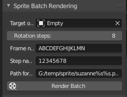
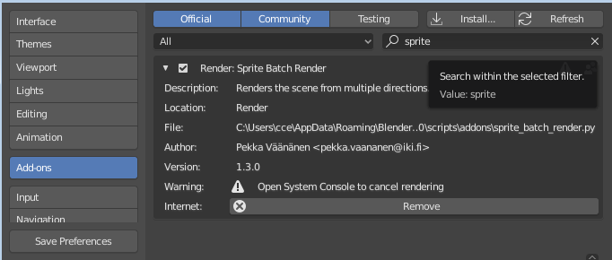
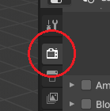

SpriteBatchRender
=================

A spritesheet rendering plugin for Blender.

## What it does

Renders the scene from multiple directions and saves the results as separate files.

Multiple frames can be rendered. The animation frame range is read from the regular
`Start Frame` and `End Frame` rendering properties.

## Usage

Create an Empty and make the models to be rotated its children. This can be done by selecting all the objects, picking the parent Empty object last and pressing <kbd>Ctrl</kbd>+<kbd>P</kbd>.

Then set the correct settings from the `Sprite Batch Rendering` section of the `Render`-tab for controls. You can see the rendering status messages in the system console (Window > Toggle System Console). Click **Render Batch** to begin rendering.

You can cancel the rendering by pressing <kbd>CTRL</kbd>+<kbd>C</kbd> in the System Console window.

### Example .blend file
[http://www.lofibucket.com/blender/suzanne2.blend](http://www.lofibucket.com/blender/suzanne2.blend) is an example how to set up the scene for sprite rendering.

The setup is the following:
* Camera projection is set to orthographic mode
* Scene render size is set to 128x128
* Frame range has been set to 0-0
* Sky color is set to transparent.

### Path format

Output path must be of format

    C:/some/path/sprite%s%s.png

where `%s` and `%s` will be replaced by frame name and rotation step respectively.

### Step names
When rendering ZDoom compatible sprites, the following naming schemes need to be used.

* 8 steps, set step names to `12345678` (default)
* 16 steps, set step names to `192A3B4C5D6E7F8G`

## Installation
Tested with Blender 2.81a.

1. Download [sprite_batch_render.py](https://raw.github.com/seece/SpriteBatchRender/master/sprite_batch_render.py) directly or as [a .zip archive.](https://github.com/seece/SpriteBatchRender/archive/master.zip).
2. In Blender User Preferences, open the **Add-ons** section, press the **Install...** button and pick the downloaded `sprite_batch_render.py`. You should now see the plugin under the Render section in the Add-on listing.
3. Enable the plugin by checking the small checkbox on the right hand side of the plugin name.

You should now see the `Sprite Batch Rendering` controls under the `Render` tab of the `Outliner`:

## Tips

* If you want lighting to stay constant, also parent the light to the root Empty object.

## License
GPLv2, see `COPYING` for details.

